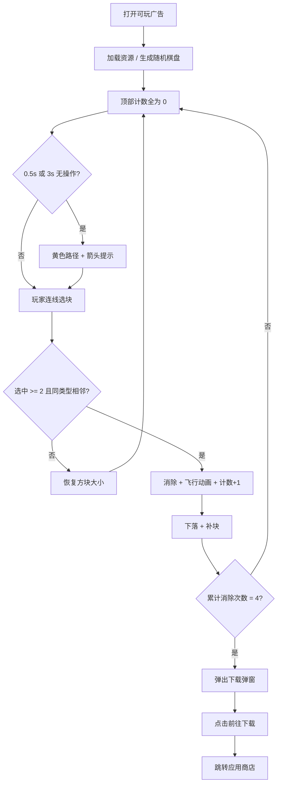

# 方块连线可玩广告 — 游戏策划案

> 文档来源：基于 [`game2_unity.html`](game2_unity.html) 当前实现逆向整理  
> 版本：v1.0（与现有 HTML 一致）  
> 投放渠道：Unity Ads（默认可玩广告上架渠道）

---

## 1. 项目概述

### 1.1 产品定位

| 项 | 内容 |
|---|---|
| 可玩广告名称 | 方块连线游戏（页面标题） |
| 引流目标产品 | **Tile Puzzle Classic** |
| Android 包名 | `com.sofish.tilepuzzle.gp` |
| Google Play | `https://play.google.com/store/apps/details?id=com.sofish.tilepuzzle.gp` |
| 玩法类型 | 连线消除 / 收集类休闲益智 |
| 体验时长目标 | 约 30 秒～2 分钟（完成 4 次有效消除后弹出下载引导） |
| 技术形态 | 单文件 HTML 可玩广告（Phaser 3.x，资源 Base64 内嵌） |

### 1.2 设计目标

1. **低门槛**：开局 0.5 秒即可能触发操作提示，3 秒无操作自动给解法演示。  
2. **高反馈**：选中缩放、飞行动画、顶部计数即时增长，强化「收集感」。  
3. **短闭环**：固定 **4 次成功消除** 后弹出 CTA，引导用户前往商店下载完整版。  
4. **全适配**：竖屏 / 横屏自动切换棋盘规格与 UI 布局，适配 Unity Ads 多尺寸库存。

### 1.3 与完整版关系

可玩广告只展示核心「连线选块 → 消除 → 收集计数」循环，不包含关卡进度、道具、付费等系统。弹窗 CTA 承担转化职责，将体验延续到正式 App。

---

## 2. 核心玩法

### 2.1 一句话描述

玩家在棋盘上用手指 **依次选中相邻（含斜向）的同色方块**，松手后若选中数量 ≥ 2，则消除所选方块；方块飞向顶部对应类型计数区并 +1，空位下落补块。累计 **4 次** 成功消除后，弹出下载弹窗。

### 2.2 操作方式

| 阶段 | 玩家行为 | 系统反馈 |
|---|---|---|
| 按下 | 在某一方块上按下 | 若弹窗未显示：暂停 idle 提示计时；清除当前提示；将该格加入选中链，方块缩至 **0.8 倍** |
| 拖动 | 滑过相邻格 | 若与上一格 **8 邻接** 且 **类型相同** 且未重复选中：加入选中链，新格同样缩至 0.8 倍 |
| 松手 | 抬起手指 | 选中数 ≥ 2 → 执行消除；否则恢复所有选中格原始尺寸；清空选中链 |

> 说明：实现中不再绘制玩家拖线，仅通过选中缩放表达「正在连线」。

### 2.3 消除规则

| 规则 | 说明 |
|---|---|
| 最少选中数 | **2 格**（代码：`selectedTiles.length >= 2`） |
| 类型限制 | 整条选中链必须为 **同一方块类型** |
| 连通性 | 相邻定义为 **8 方向**（上下左右 + 四个斜角），且 `(rowDiff + colDiff > 0)` |
| 不可重复 | 同一格在一次操作中只能选中一次 |
| 消除后处理 | ① 飞行动画至顶部对应类型图标 ② 销毁棋盘格 ③ 列内方块下落 ④ 顶部随机生成新方块填入空位 |

### 2.4 棋盘规格

| 屏幕方向 | 列 × 行 | 判定条件 |
|---|---|---|
| 竖屏 | **7 × 11** | `innerHeight > innerWidth` |
| 横屏 | **11 × 7** | 否则 |

- 方块种类：**6 种**（资源 key：`1`～`6`）  
- 初始填充：每格随机 `0～5` 类型之一  
- 方块尺寸：根据可用区域动态计算，**最小 30px**  
- 棋盘边距：左右各留 **20px**（`BOARD_MARGIN`）  
- 顶部统计区固定高度约 **100px**，棋盘紧贴其下方

### 2.5 顶部收集区

- 顶部横向排列 **6 个类型图标**，每个图标左上角显示白色计数（初始 **0**）。  
- 每次成功消除某类型 N 格，该类型计数 **+N**（每格飞入动画结束后分别 +1）。  
- 统计区有深色底条（`#34495e`，80% 透明度），图标尺寸随横竖屏自适应。

### 2.6 胜负与结束条件

| 条件 | 结果 |
|---|---|
| 累计成功消除 **4 次** | 延迟 300ms 弹出 **下载引导弹窗**，棋盘操作锁定 |
| 无失败 / Game Over | 棋盘可无限继续消除（弹窗出现后除外） |
| 弹窗出现后 | 遮罩层拦截操作，仅 CTA 按钮可点 |

> 代码注释写「消除成功 2 次显示弹窗」，实际触发阈值为 **`eliminateCount === 4`**，以代码为准。

---

## 3. 引导与提示系统

### 3.1 设计目的

降低首次试玩流失：让玩家在几乎无思考成本下完成第一次有效操作，并尽快进入「消除 → 收集 → 再消除」的正反馈循环。

### 3.2 触发时机

| 场景 | 触发条件 |
|---|---|
| 开局引导 | 进入场景后 **0.5 秒**，若仍无有效操作 |
| Idle 引导 | 距上次有效操作 **≥ 3 秒** |
| 不触发 | 弹窗显示中 / 玩家正在按住拖动（`isHintPaused`）/ 已有提示在播 |

### 3.3 提示内容

- 使用 DFS 在棋盘上搜索一条 **3～4 格**、同类型、8 邻接连通路径。  
- 视觉表现：  
  - **亮黄色路径线**（线宽 6，透明度 0.8）  
  - **箭头精灵**沿路径逐格移动，总时长 **2 秒**  
- 提示播放结束 1 秒后，若玩家仍无操作，可再次进入 3 秒 idle 判定。

### 3.4 与正式消除的差异

- 提示路径长度为 **3～4 格**，但玩家实际只需 **≥ 2 格** 即可消除。  
- 提示仅演示，不自动帮玩家完成操作。

---

## 4. 界面与视觉

### 4.1 整体风格

| 元素 | 规格 |
|---|---|
| 页面 / 游戏背景色 | `#1a1a2e`（深蓝紫） |
| 字体 | Arial，白色为主 |
| 引擎 | Phaser 3.x，`Scale.RESIZE` 全屏自适应 |
| 触控 | 禁用页面缩放、双击缩放、手势缩放 |

### 4.2 布局结构（自上而下）

```
┌─────────────────────────────────┐
│  顶部收集条（6 类型图标 + 计数）   │  ~100px
├─────────────────────────────────┤
│                                 │
│         连线消除棋盘               │  动态尺寸
│                                 │
└─────────────────────────────────┘
```

### 4.3 方块视觉

- 优先使用内嵌 PNG（Base64）；加载失败时使用 6 色矩形占位：  
  红 `#e74c3c`、蓝 `#3498db`、绿 `#2ecc71`、黄 `#f1c40f`、紫 `#9b59b6`、橙 `#e67e22`  
- 显示区域为正方形（非方图裁剪居中），比格子里略小 4px 边距。

### 4.4 动画清单

| 动画 | 参数 |
|---|---|
| 选中缩放 | 0.8 倍，松手失败则还原 |
| 消除飞行 | 400ms，多格错峰 50ms，飞向顶部对应图标，缩放至 0.3 |
| 方块下落 | 200ms / 格 |
| 新块落入 | 200ms，列内自上而下错峰 50ms |
| 弹窗入场 | 300ms，`Back.easeOut`，从 scale 0 → 1 |
| 提示箭头 | 2000ms 沿路径逐段 tween |

### 4.5 下载弹窗（End Card）

**触发**：第 4 次成功消除后。

**结构**：

| 层级 | 内容 |
|---|---|
| 全屏遮罩 | 黑色 70% 透明，depth 19999，不可点穿 |
| 弹窗容器 | depth 20000，居中 |
| 背景 | 优先 `popupBg` 图；否则 `#2c3e50` 85% + 白描边 4px |
| 图标 | `popupIcon`，竖屏最大 120px / 横屏最大 100px |
| 标题文案 | **Tile Puzzle Classic** |
| CTA 按钮 | 文案 **「前往下载」**，绿色 `#2ecc71`，hover `#27ae60`，宽约弹窗 70% |
| 按钮行为 | 跳转 Google Play（`window.open`，由广告 SDK 桥接层改写为商店链接） |

**弹窗尺寸**：

- 竖屏：宽约屏宽 80%（300～400px），高约屏高 70%（350～500px）  
- 横屏：宽约屏宽 85%（300～500px），高约屏高 85%（300～400px）  
- 四周至少留 20px 安全边距

---

## 5. 体验流程（玩家视角）



---

## 6. 数值与节奏

| 参数 | 数值 | 备注 |
|---|---|---|
| 方块类型数 | 6 | 固定 |
| 成功消除触发弹窗 | **4 次** | 可调优项 |
| 最少消除格数 | 2 | 提示演示 3～4 格 |
| 开局提示延迟 | 0.5 s | |
| Idle 提示延迟 | 3 s | |
| 提示动画时长 | 2 s | |
| 消除后下落延迟 | 500 ms | 再执行 drop + fill |
| 弹窗延迟 | 300 ms | 第 4 次消除后 |
| 加载页文案 | 「加载中...」 | 带进度条 |

**预期节奏（理想路径）**：

- 0～5 s：看提示 → 完成第 1 次消除  
- 5～30 s：再完成 3 次消除（可借助 idle 提示）  
- 30 s 左右：弹窗出现 → 用户点击 CTA  

---

## 7. 适配与技术约束

### 7.1 屏幕适配

- 支持 **竖屏 + 横屏**，旋转时若行列数变化则 **重建棋盘**（清除旧精灵、重新随机布局）。  
- 仅尺寸变化不改变方向时，只更新坐标不重 roll 棋盘。  
- 监听 `resize`、`orientationchange`。

### 7.2 Unity Ads 可玩规范（对照现状）

| 规范项 | 现状 | 说明 |
|---|---|---|
| 单文件 HTML | ✅ | 约 1.6 MB，低于 5 MB 上限 |
| 资源内嵌 | ✅ | Phaser + 图片 Base64 内联 |
| 外部引用 | ⚠️ | 头部引用 `mraid.js`（Unity 环境由 SDK 注入，本地预览用 shim） |
| 横竖屏 | ✅ | 已实现 |
| CTA 跳转商店 | ✅ | Android GP 链接已配置；iOS 链接当前为空 |
| MRAID 生命周期 | ⚠️ | 游戏立即 `new Phaser.Game`，未显式等待 `viewableChange` |
| 自动跳商店 | ✅ 合规 | 仅用户点击 CTA 后跳转 |

### 7.3 广告 SDK 桥接（实现层）

HTML 尾部包含多平台桥接脚本，主要能力：

- 占位 `gameStart` / `gameEnd` / `gameClose` / `install`  
- 将 `ExitApi.exit`、`super_html.download`、`mraid.open`、`window.open` 统一接到 `install()`  
- Luna Unity `InstallFullGame` 兼容  
- 静态预览时将 `window.open` 重定向到 Google Play  

策划侧只需知：**所有「去下载」入口最终应走广告 SDK 的 install / mraid.open 链路**。

---

## 8. 资源清单

| 资源 key | 用途 | 来源 |
|---|---|---|
| `1`～`6` | 六种方块图 | Base64 内嵌 |
| `popupIcon` | 弹窗 App 图标 | Base64 内嵌 |
| `arrow` | 提示箭头 | Base64 内嵌（对应 `resource/arrow.png`） |
| `popupBg` | 弹窗背景（可选） | 未内嵌时使用纯色 |
| `statsBg` | 顶部统计条背景（可选） | 未内嵌时使用纯色 |

---

## 9. 文案表

| 位置 | 文案 | 语言 |
|---|---|---|
| 页面标题 | 方块连线游戏 - Phaser版 | 中文 |
| 加载中 | 加载中... / 0%～100% | 中文 |
| 弹窗标题 | Tile Puzzle Classic | 英文 |
| CTA 按钮 | 前往下载 | 中文 |
| 控制台（调试） | 前往下载: {url} | 中文 |

---

## 10. 埋点与转化建议（策划扩展）

当前 HTML **未内置自定义 analytics 事件**。若后续迭代，建议至少上报：

| 事件 | 时机 |
|---|---|
| `playable_start` | 首帧可交互 |
| `first_eliminate` | 第 1 次成功消除 |
| `hint_shown` | 提示展示 |
| `eliminate_N` | N = 1～4 |
| `popup_show` | 弹窗展示 |
| `cta_click` | 点击前往下载 |

---

## 11. 已知问题与优化建议

| 项 | 描述 | 建议 |
|---|---|---|
| 注释与代码不一致 | 注释写 2 次消除出弹窗，实际为 4 次 | 统一文档与注释 |
| iOS 商店链接 | `_ios` 为空 | 补充 App Store URL 后再投 iOS 库存 |
| MRAID 启动时机 | 未等 `viewableChange` 即开游戏 | 按 Unity 规范包裹 Phaser 启动 |
| CTA 调用方式 | 弹窗内直接用 `window.open` | 改为 `mraid.open(url)` 更稳妥 |
| 弹窗后无法继续玩 | 设计如此 | 若需延长体验，可将弹窗改为可关闭的 End Card |

---

## 12. 附录：关键代码锚点

便于程序 / 策划对照：

| 功能 | 文件位置（约） |
|---|---|
| 棋盘行列 | `updateOrientation()` — 竖 7×11 / 横 11×7 |
| 消除判定 | `stopDrawing()` — ≥2 格消除 |
| 弹窗触发 | `eliminateTiles()` — `eliminateCount === 4` |
| 弹窗 UI | `showPopup()` — Tile Puzzle Classic + 前往下载 |
| 提示系统 | `checkAndShowHint()` / `findHintPath()` — 3～4 格路径 |
| 商店链接 | 头部 `__playable_tool_redirect__` — Android GP |

---

**文档结束**
